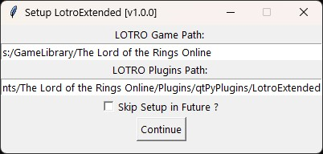

# LotroExtended v1.0.0

LotroExtended is a tool that allows for Python Scripts to run alongside Lord of the Rings Online - a useful tool for plugin devs that want more power!



## Features

- Enables Python Scripts to run alongside Lord of the Rings Online
- Custom Install Setups to be manually configured by the user

## Installation

### Download

Download latest .zip from releases.

Unzip to your preferred location.

Go to the project directory

```bash
  cd lotro_extended
```

Then make sure to run the **LotroExtended.bat** or call the following:

```bash
  python lotro_extended.py
```

Follow the setup process including setting your paths.

Congratulations, you've successfully installed LotroExtended!

### Bash

Clone the project

```bash
  git clone https://github.com/qtPyDev/lotro_extended
```

Go to the project directory

```bash
  cd lotro_extended
```

Then make sure to run the **LotroExtended.bat** or call the following:

```bash
  python lotro_extended.py
```

Follow the setup process including setting your paths.

Congratulations, you've successfully installed LotroExtended!

## FAQ

#### Can I use this to support my plugins for LOTRO ?

Absolutely ! No support (financial or linking credit) is required, just enjoy using the tool !

#### Why are you so cool ?

Real,,,

## Support

For support, contact @qtpy.dev on Bluesky.
